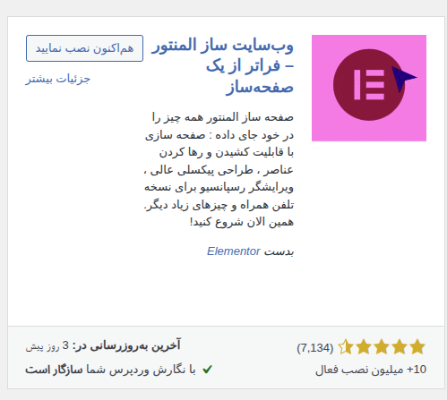

# wp-dev-playground

## Table of Contents

- [About](#about)
- [Check List](#check-list)
- [Quick Start](#quick-start)
- [Access](#access)
- [Getting Started with WordPress](#getting-started-with-wordpress)
- [Plugins](#plugins)
  - [Elementor](#elementor)
  - [Elementor Pro](#elementor-pro)
- [Issues and Fixes](#issues-and-fixes)
  - [WordPress About page shows "Not Found"](#wordpress-about-page-shows-not-found)
  - [Maximum upload file size exceeded](#maximum-upload-file-size-exceeded)
- [Resources](#resources)

## About

A sandbox for learning WordPress development — custom themes, plugins, and headless integration experiments.

## Check List

1. [x] Installing and Getting Started with WordPress
2. [ ] How to support multiple languages
3. [ ] How to support RTL
4. [ ] How to have Tailwind css

## Quick Start

```bash
docker compose up -d
```

## Access

- WordPress Admin Dashboard: [http://localhost:8080/wp-admin/](http://localhost:8080/wp-admin/)

  - Login with the username and password you set on the first run (see `local-creds.yml` for details).

- phpMyAdmin: [http://localhost:8081](http://localhost:8081)

  - Server: `db`
  - Username: `root`
  - Password: Your MySQL root password from `.env`

- Main Site Domain: [http://localhost:8080](http://localhost:8080)

---

For any access issues:

- Ensure Docker containers are running (`docker compose up -d`).
- Verify your credentials in `local-creds.yml` and `.env` files.
- Check that ports 8080, 8081, and 8082 are not blocked or used by other applications.

## Plugins

### Elementor

Left Manue -> Plugins -> Add Plugin -> Search `elementor` -> Click on Install -> Activate



### Elementor Pro

Left Manue -> Plugins -> Add Plugin -> Upload Plugin -> Choose File `./plugins/elementor-pro-3-32-3.zip` -> Click on Install Now -> Activate

## Issues and Fixes

### WordPress About page shows "Not Found"

Your permalink structure may be broken.

Fix:

1. Go to WordPress Dashboard → Settings → Permalinks
2. Without changing anything, click Save Changes

### Maximum upload file size exceeded

It already fixed by adding `uploads.ini` file in `php-conf` directory.

## Resources

- [Polylang Plugin](https://www.youtube.com/watch?v=H98fijfD6CY)
- [WordPress Training Course by Daneshjooyar](https://www.daneshjooyar.com/wordpress-training/)
- [WordPress Course by Beban](https://beban.ir/courses/wordpress/)
