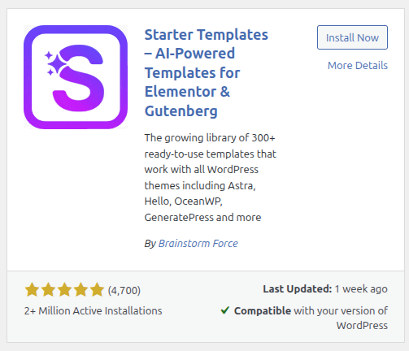

# wp-dev-playground

##

```bash
docker compose up -d
```

## Access

- WordPress Admin Dashboard: [http://localhost:8080/wp-admin/](http://localhost:8080/wp-admin/)

  - Login with the username and password you set on the first run (see `local-creds.yml` for details).

- phpMyAdmin: [http://localhost:8081](http://localhost:8081)

  - Server: `db`
  - Username: `root`
  - Password: Your MySQL root password from `.env`

- Main Site Domain: [http://localhost:8080](http://localhost:8080)

---

For any access issues:

- Ensure Docker containers are running (`docker compose up -d`).
- Verify your credentials in `local-creds.yml` and `.env` files.
- Check that ports 8080, 8081, and 8082 are not blocked or used by other applications.

This setup provides easy access to WordPress admin, database management tools, and the main site for your development playground.

##

A sandbox for learning WordPress development — custom themes, plugins, and headless integration experiments.

👉 http://localhost:8080

Left Manu -> Appearance -> Themes -> Add Theme -> Search `Astra` -> Click on Install -> Activate

Let's head over to Left Manue -> Plugins -> Add Plugin -> Search `Starter template elementor` -> Click on Install -> Activate


